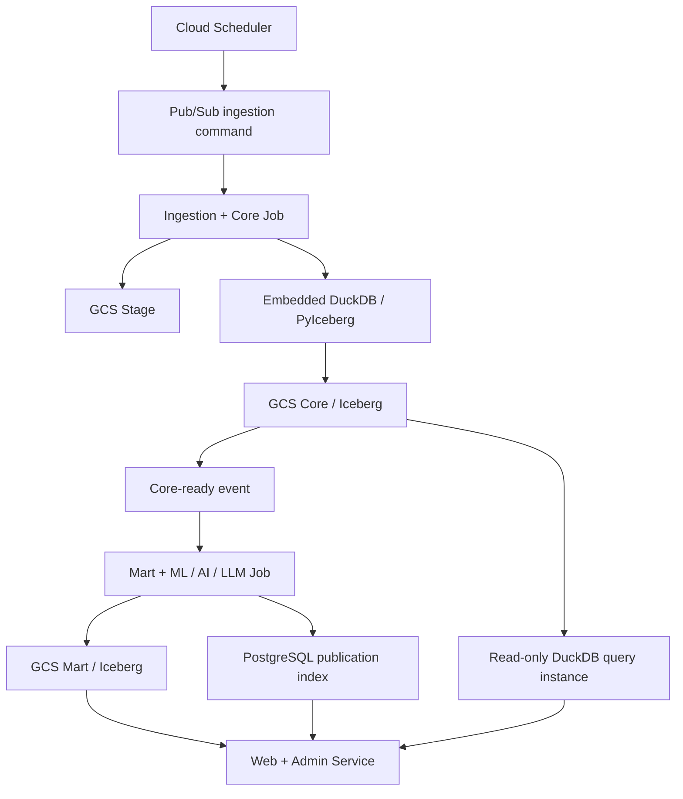

# Janus × OmniForge — Project Specification

版本：1.1
日期：2026-08-28
狀態：GCP-first、DuckDB／Iceberg 與資料源雙軌基線

## 1. 產品目標

建立以台股為主的湖倉型智慧投資研究平台：將官方與核准 fallback 資料寫入 GCS Stage，經內嵌 DuckDB／PyIceberg 清理為 Iceberg Core，再由 ML、五角色 Agent 與 LLM 解釋層產製 Mart；公開 UI 與 Admin UI 只讀取已持久化、符合發布政策的成品。

資料供應採雙軌策略：以全市場約 1,700–2,000 檔的低成本日頻資料作為篩選大網，再對最多 50 檔由 control DB 明確啟用的核心標的收集較高頻、文本與另類資料。實際檔數以當日股票 master 與市場狀態為準，不以固定常數代表完整市場。

系統是研究與風險提示工具，不是自動下單、持倉管理、持牌投顧或保證獲利服務。

## 2. 已確認的架構決策

- 從第一天起在 GCP 開發、測試與部署，不以地端 runtime 為必要條件。
- 一個 GitHub monorepo，三個業務領域、三個主要 GCP 部署單元；Core query 能力由 Job／Web 各自內嵌的 DuckDB runtime 提供。
- GCS + Iceberg + DuckDB／PyIceberg 是資料主架構；DuckDB 不作為獨立持久資料庫。
- PostgreSQL 只保存 Iceberg catalog、控制、治理、execution、publication、audit 與服務索引。
- Dev／MVP PostgreSQL 採 Compute Engine `e2-micro` 單一 VM 自架，位於 `us-central1`；Free Tier 模式限制 Standard Persistent Disk 總量 ≤30 GB、不配置 external IP，並以 IAP／OS Login 管理。此配置不作為 production HA 架構。
- `e2-micro` 僅承載 PostgreSQL，不承載 DuckDB 分析工作；DuckDB 內嵌於 Cloud Run Job／Service process，暫存與記憶體限制由各 runtime 獨立管理。
- 開發／重構期最低有效完整度為 30%；正式發布門檻日後依 PIT 回測與人工治理調整。
- LLM 做提取、摘要、解釋與白話轉譯，必要時也計算 deterministic 分數、不補值、不決定發布。
- 第一版 LLM provider 使用順序固定為：Gemini → OpenRouter → GroqCloud；取消 Vertex AI。僅在可重試的 rate limit、quota exhaustion 或 provider unavailable 情況切換下一個 provider；非 429／`RESOURCE_EXHAUSTED` 的結構化錯誤不得以其他 provider 靜默改寫結果。
- Cloud Run Service 全部 `min-instances=0`；寫入 Core 的 ingestion Job 單 task 執行，Web／query runtime 對 Core 採 read-only。
- Artifact Registry 可由 source deploy／Cloud Build 自動管理，但底層仍需保存容器映像。
- Artifact Registry 僅使用 image、digest、metadata 與 cleanup；禁止 Artifact Analysis API、Container Scanning API、vulnerability scanning 與 occurrence API。SBOM 僅可離線產生，不以掃描結果作為 build gate。

## 3. Monorepo 結構

```text
janus-omniforge/
├── apps/
│   └── web/                         # Next.js public + admin + BFF
├── jobs/
│   ├── ingestion-core/              # Scrapers、Stage、DQ、Core
│   └── intelligence-mart/           # Features、ML、Agents、LLM、Mart
├── packages/
│   ├── contracts/                   # Schema、events、API types
│   ├── governance/                  # Parameters、publication policy
│   ├── provenance/                  # Provenance model／validation
│   ├── observability/               # Logging、metrics、errors
│   └── duckdb_query/                # bounded DuckDB／Iceberg read-write primitives
├── infra/                            # Terraform／Cloud Build／IAM
├── tests/
│   ├── contract/
│   └── e2e/
└── docs/
```

部署單元：

1. `ingestion-core`：Cloud Run Job。
2. `intelligence-mart`：Cloud Run Job。
3. `web`：Cloud Run Service，公開 UI、Admin UI 與短生命週期 API/BFF；Core query 可使用獨立、read-only 的內嵌 DuckDB instance。

## 4. GCP 拓撲



建議區域：`us-central1`。開發初期可使用單一 `janus-dev` project，但 dev／staging／prod 至少要以 bucket、catalog/schema、service account、Cloud Run 名稱與 secret 完整隔離；正式上線前改成三個 project。

## 5. 湖倉分層

| 層 | 格式 | 責任 | 寫入者 | 讀取者 |
|---|---|---|---|---|
| Stage／Bronze | 原始 JSON、CSV、受控物件 | 保存來源原貌、request metadata、hash | ingestion-core | ingestion-core、治理稽核 |
| Core／Silver | Iceberg／Parquet | 正規化、去重、單位、日期、null、PIT、provenance、文本與股票代號關聯 | ingestion-core／DuckDB／PyIceberg | intelligence-mart、read-only query runtime |
| Mart／Gold | Iceberg／Parquet、Markdown export | 特徵、角色輸出、聚合、研報、評估 | intelligence-mart | Web、Admin、OmniForge |

規則：

- 不可把所有 0 一律轉成 null；須依欄位語意處理。
- 單日漲跌超過 11% 不可直接刪除；先檢查市場限制、除權息、公司行動與跨源差異。
- Core／Mart 使用 immutable snapshot 或 versioned partition，支援重跑與 PIT。
- UI 不得直接讀 Stage 或未發布 Core。
- Core 保存可重算的來源資料與 deterministic 標準化結果；NER 關聯必須保留模型／規則版本與 evidence。情緒分數、AI 示警、動態權重與投資判讀屬 Mart，不得回寫成來源事實。

## 6. 資料供應模型與正式資料來源

### 6.1 雙軌 coverage

| 軌道 | 對象 | 預設頻率 | 必要資料 | 用途 |
|---|---|---|---|---|
| 全市場量化網 | 股票 master 當日所有 enabled 上市／上櫃標的，約 1,700–2,000 檔 | 日頻／公告頻率 | 日 OHLCV、PE/PB、法人、融資券／借券／當沖、基本面摘要、benchmark | 異動偵測、流動性檢查、每日 screening |
| 核心標的放大鏡 | control DB 明確啟用且最多 50 檔 | 日頻加上經核准的分 K／Tick、事件與文本 | 深度財報、公司行動／重大訊息、新聞與核准另類資料 | 深度特徵、風險分析、PIT 回測與研究報告 |

- `coverage_tier`、標的 membership、effective time、collection cadence 與授權狀態必須持久化並可稽核；核心 50 名單變更不得改寫歷史 membership。
- 高頻、文本與另類資料不得因全市場 collection 自動擴張；超過 50 檔或提高抓取頻率須另行評估來源限制、Cloud Run/GCS 成本與授權。
- collection 與 analysis 分離；進入核心名單只代表可收集相應資料，不代表可發布、推薦或自動下單。

### 6.2 五層資料供應責任

1. 官方市場資料：TWSE／TPEx OpenAPI、經核准的 MIS、MOPS、TAIFEX 與政府行事曆。
2. 外部財經資料：只納入已確認 API、授權、保存與再發布條款的供應者，作 enrichment／fallback，不能默認取代官方來源。
3. 平台清理分類：代號、時間、股／張、上市櫃／興櫃、產業／概念與文本實體對應。
4. 平台計算推導：權值貢獻、融資風險、目標價共識、聲量／情緒、AI 示警；輸出必須標示算法／模型版本並進 Mart。
5. 排程快取健康：來源成功率、成功數、latency、freshness、休市校正、cache age、fallback 與 schema drift。

### 6.3 來源矩陣

| 領域 | Coverage | Primary | Fallback／限制 |
|---|---|---|---|
| OHLCV、PE/PB | 全市場日頻 | TWSE／TPEx | FinMind；yfinance 僅具名低優先 enrichment |
| 法人／信用／借券／當沖／警示 | 全市場日頻 | TWSE／TPEx | 缺資料標 unavailable，不推算 |
| 月營收／季報 | 全市場摘要、核心 50 深度 | MOPS | FinMind(MOPS fallback)，三類報表分別抓取與 provenance |
| 公司事件／重大訊息 | 全市場索引、核心 50 全文或結構化內容 | TWSE／TPEx／MOPS | 更正公告保留新舊版本；RSS／頁面抓取須先確認穩定性與使用條款 |
| Benchmark／期貨宏觀 | 市場級 | 官方 TAIEX／TPEx、TAIFEX、政府行事曆 | 優先報酬指數，否則明示價格指數；美股／費半資料須使用核准 provider |
| 持股級距 | 全市場或核心 50，依來源能力 | TDCC／政府開放資料 | bucket 定義與更新頻率待人工核准 |
| 分 K／Tick | 核心 50 | 經核准 TWSE／TPEx MIS 或授權行情源 | 必須遵守 rate limit、使用與保存條款；未核准不得排程 |
| 新聞／券商研究／目標價 | 核心 50 | 核准授權來源 | CMoney、鉅亨／FactSet、Tiingo、Yahoo／Google 等均為候選；逐一完成授權與 provenance 審查後才能啟用 |
| Podcast／社群文本 | 核心 50 | 創作者授權、平台條款允許或合法公開資料 | PTT、Dcard、股市爆料同學會及 Podcast 只列候選；須先完成收集、保存、刪除、PII、引用與再發布政策 |
| Adjusted close | 核心 50／需要回測者 | 官方公司行動重建（目標） | yfinance Adj Close 僅具名 enrichment |

任何候選來源在完成 legal／license、robots／API terms、rate limit、retention、PII、可引用範圍與成本核准前，狀態必須是 `candidate`／`blocked`，不得進 production collection 或公開 UI。

## 7. Provenance 與時間

所有重要資料必須記錄：

```yaml
provenance_id: string
source_name: string
source_url: safe_url
dataset: controlled_id
observed_at: datetime
published_at: datetime | null
fetched_at: datetime
content_hash: string
is_fallback: boolean
quality_flags: string[]
quality_details: object
```

- `observed_at`、`published_at`、`fetched_at`、`effective_date` 不可互相替代。
- 財報、事件、新聞遵守 `published_at <= analysis_as_of`。
- 市場觀測以 observed_at 判斷時序；沒有獨立 published_at 不等同業務缺值。
- raw payload、object URI、secret、完整 upstream error 不得出現在一般 API/UI。
- 相同 source + dataset + observed time + hash 重用 provenance；內容或時間改變才新增版本。
- PostgreSQL 只保存 control／catalog／execution／publication／audit metadata；raw payload 與 response cache payload 必須留在 GCS Stage，資料庫只保存 URI、hash、TTL 與狀態。

## 8. Ingestion + Core Job

職責：

- async HTTP、bounded timeout、retry、rate limit、schema drift 偵測。
- 原始回應先寫 Stage，再正規化為 Core。
- 增量抓取、交易日／休市校正、全市場回應批次快取。
- 保存 empty、partial、fallback、stale、rate-limited、unavailable。
- 不用新回應的 null 覆蓋既有有效值。
- 通過 DQ 後發出 `core.dataset.ready.v1`；失敗寫 execution 與 quarantine。

不得：執行 Agent、產生研報、呼叫 LLM 或更改 publication。

## 9. Mart + ML／AI／LLM Job

職責：

- 只讀 versioned Core snapshot；禁止即時補抓。
- 產製特徵、ML artifacts、五角色輸出、Evidence Validator、Aggregator。
- 套用 governance snapshot 與 publication policy。
- LLM 依合格 evidence 產生繁體中文結構化摘要。
- 寫入 Mart、report metadata、publication index 與 `mart.report.ready.v1`。

資料超市至少區分：

- `mart_screening_signals`：全市場日頻異動、技術面、量能與流動性篩選。
- `mart_core_alpha`：核心 50 的基本面、事件、核准新聞與另類資料綜合特徵。
- `mart_risk_portfolio`：波動、回撤、流動性、滑價與信用風險；不直接執行交易。
- `mart_alternative_sentiment`：核准文本的聲量、情緒、來源分布與不確定性；不得把無來源模型判讀當作事實。
- `mart_master_investment_memo`：彙整五角色、screening、risk 與 sentiment evidence 的 CIO 觀點。

五角色：Fundamental、Valuation Risk、Positioning、Quant、Event Risk。

主要規則：

- Fundamental：12 月營收、12 季財報，一般／金融業分流。
- Positioning：5／20／60 日正規化，單日買超不直接判多。
- Quant：20／60／120 日相對強弱、量能、波動、回撤、Beta、ATR、turnover；少於 20 筆有效行情 score=null。
- Event Risk：只納入 PIT 合格事件；可觸發 manual review。
- 參考停損 `last_close - 2 × ATR(14)`，只作風險參考。
- Devil's Advocate 是 Aggregator 的強制反證階段，不是第六個可自行補資料的角色；必須引用既有 evidence。
- 歷史記憶／RAG 只可檢索 analysis-as-of 當時可見的 versioned Core／Mart snapshot，禁止 future leakage。

## 10. Aggregator 與發布治理

初始權重：Fundamental 25%、Valuation 20%、Positioning 20%、Quant 25%、Event Risk 10%。

```text
effective_weight = base_weight × completeness × confidence × data_quality / 100
```

- 開發期有效完整度 <30% 或沒有有效分數：`insufficient_data`。
- aggregate ≥60：偏多；≤40：偏空；其餘中立。
- 必須同時輸出 bull、bear、contradictions、contributions。
- confidence 必須明示「資料／分析信心度，非獲利機率」。

發布矩陣：

| 條件 | publication status |
|---|---|
| FUTURE_DATA／INVALID_SOURCE_URL／MISSING_CRITICAL_SOURCE | blocked |
| manual_review_required=true | blocked |
| critical event | blocked |
| high event 且 risk score ≥75 | blocked |
| completeness <30% 或無有效分數 | insufficient_data |
| 驗證及政策通過 | publishable |

所有權重與門檻除已核准發布政策外，均視為開發期保守設定；正式值須 PIT 回測與人工 revision。

## 11. DuckDB／Iceberg runtime boundary

- Ingestion Cloud Run Job 內嵌一個 bounded DuckDB instance，負責 Stage → Core 的 deterministic merge 與 Iceberg commit；單 task、單 writer，限制 threads、memory、timeout 與 temp directory。
- 未來 Core query API 可在 Web 或獨立 Cloud Run Service 內嵌另一個 read-only DuckDB instance。這是另一個 process，不是第二份持久資料庫；兩者共用 GCS Iceberg snapshots 與 PostgreSQL catalog metadata，不共享本機 DuckDB 檔案。
- Query runtime 不得寫 Core；寫入仍由 ingestion Job 序列化，避免並行 Iceberg commit 衝突。
- DuckDB 本機資料、spill 與 temp 均為可丟棄暫存；GCS 保存 Iceberg data/metadata，PostgreSQL 只保存 catalog、control、publication、audit 與服務索引。
- backfill 必須拆批並限制 scan rows／bytes、memory、timeout；超過單機與 Cloud Run 執行限制時，再評估分散式引擎，不預先恢復 Trino。

## 12. Web 與 API

- Next.js 公開 UI、Admin UI 與 BFF/API 共用一個 Cloud Run Service。
- 公開端只讀 publishable Mart／service index。
- 404 不觸發即時爬蟲、Agent 或 LLM。
- Admin 只寫 control DB／queue，不在 request 中執行長任務。
- blocked report、raw payload、secret、traceback、broker data 不得公開。
- UI 詳細契約見 `ui.md`。

## 13. GCP 開發與 CI/CD

| 項目 | 選擇 |
|---|---|
| 開發環境 | Cloud Workstations；低頻可用 Cloud Shell Editor |
| 原始碼 | GitHub monorepo、branch protection、PR review |
| GCP 認證 | Workload Identity Federation，不使用長效 JSON key |
| 建置 | Cloud Build path-based pipelines |
| Image | Artifact Registry，由 source deploy／Cloud Build 管理 |
| 部署 | 同一 immutable image digest 依序 promote dev → staging → prod |
| Secret | Secret Manager，runtime identity 單項授權 |
| IaC | Terraform；production apply 需人工批准 |

### 13.1 Dev PostgreSQL VM

- 使用 Compute Engine `e2-micro`，只承載 control plane、Iceberg catalog、publication index 與 audit metadata；GCS／Iceberg 不搬到 VM。
- PostgreSQL 使用 private IP；Cloud Run、Cloud Run Jobs 與 DuckDB 所在 runtime 僅透過 VPC 連線，禁止公開 `5432`。
- VM 使用 Standard Persistent Disk，Free Tier 模式總配置量 ≤30 GB；不自動建立 snapshot／backup，資料庫 credential 存 Secret Manager。任何備份與 restore drill 必須另行評估費用。
- `e2-micro` 只有 1 GiB RAM，僅限 dev／MVP 低併發；production 必須重新評估 dedicated VM、HA 或其他 managed PostgreSQL 方案。
- Free Tier 目標另受 billing account 資格、每月 1 GB outbound 額度與其他 GCP 資源費用影響；Terraform 限制規格不等於保證帳單為 US$0。
- Compute Engine 與 Standard Persistent Disk 依 instance 運轉時間、provisioned disk、snapshot 與網路流量計費；實際價格以 [Compute Engine pricing](https://cloud.google.com/products/compute/pricing) 為準。

PostgreSQL VM 是 Iceberg SQL catalog 與 control DB 的前置基礎；必須先完成 VM、private connectivity、schema／role bootstrap、PostgreSQL repository migration 與 smoke query，才可部署內嵌 DuckDB 的 Cloud Run runtime。SQLite control repository 僅供 unit tests，不是 production backend。

### 13.2 Artifact Registry cost guard

- Cloud Build 可 build、push image、解析 immutable digest 與執行 cleanup；不得呼叫 Artifact Analysis API、Container Scanning API、vulnerability scanning 或 occurrence API。
- SBOM 如有需要，使用本地工具產生 SPDX／CycloneDX，作為一般 build artifact 保存；不建立掃描 occurrence，也不等待 vulnerability result。

Schema evolution、migration、backfill、production Job trigger 不得隨 Web deployment 自動執行。

## 14. 非功能需求

- 冪等、可重跑、可追溯、可安全失敗。
- GCP services 同區以避免跨區成本。
- 統一 execution／trace ID；log redaction。
- 監控來源成功率、latency、freshness、schema drift、fallback、Job 狀態、publication 與 API error。
- 設定 Cloud Billing US$1／US$5／US$10 告警、GCS lifecycle、Artifact Registry cleanup、Workstation 自動停止。
- 不宣稱固定 $0；費用以當期定價與實際帳單為準。

## 15. Release Gate

- 2330 完成 Source → Stage → Core → Mart → API → UI 閉環。
- PIT 無 future leakage；排除樣本有原因與 provenance ID。
- blocked 不進公開 latest／history；查無資料不即時運算。
- 兩個 Job、Web 與各內嵌 DuckDB runtime 的 IAM、timeout、retry、監控與 rollback 通過。
- 全市場日頻與核心 50 membership／cadence 邊界通過驗證；未核准的高頻、新聞、Podcast 或社群來源保持 disabled／blocked。
- pytest、Vitest、Playwright、TypeScript、production build、contract tests 通過。
- iOS Safari、Android Chrome、iPad Safari、VoiceOver、TalkBack、WCAG AA 實機通過。
- 無 secret、raw payload、敏感 URL、未授權來源外洩。
- runbook、備份、還原與 rollback 演練完成。
