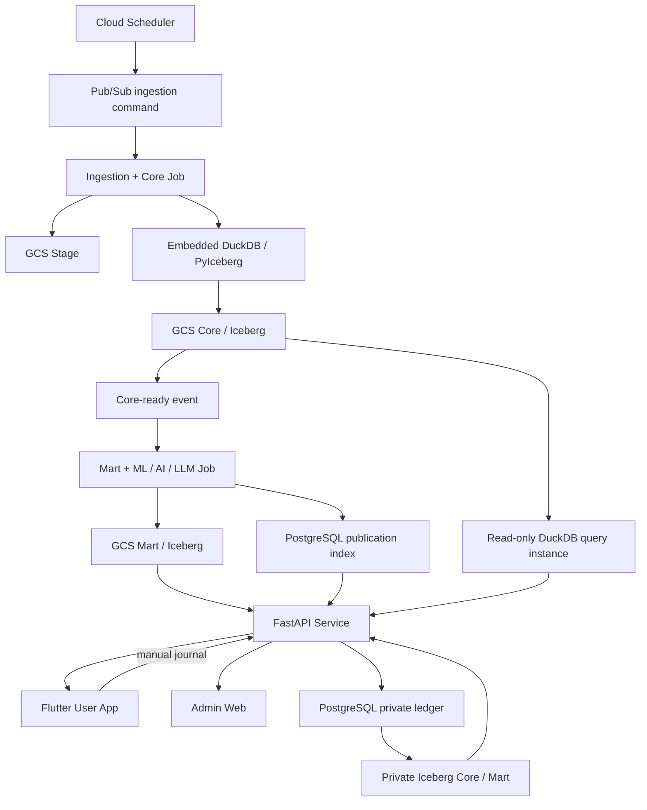

# Janus — Project Specification

版本：1.7
日期：2026-08-31
狀態：資料產品優先、GCP-first、DuckDB／Iceberg 與資料源雙軌基線

## 1. 產品目標

建立以台股為主的湖倉型智慧投資研究平台：將官方與核准 fallback 資料寫入 GCS Stage，經內嵌 DuckDB／PyIceberg 清理為 Iceberg Core，再由 deterministic features、ML、五角色 Agent 與 LLM 解釋層產製 Mart。產品先回答六個問題：現在市場是什麼狀態、今日重點是什麼、哪些板塊在變化、資金往哪裡輪動、哪些話題升溫，以及候選股為什麼值得進一步研究。

User App 與 Admin UI 是兩個獨立入口。Flutter 的公開研究頁只讀取符合發布政策的公開 Mart 成品，私人交易筆記只讀取 authenticated user 的 ledger／Private Mart；Admin Web 用於資料營運、治理、執行與發布審查。兩者均經 FastAPI 契約取用已持久化資料，不直讀 Stage，也不在 request 內觸發即時爬取、Agent 或 LLM。

個人交易筆記是 User App 的私人功能：PostgreSQL append-only ledger 保存使用者手動輸入的交易事實、冪等鍵與單調遞增 `ledger_version`。受限制的 private pipeline 依 persisted checkpoint 批次讀取新版本，直接正規化至 Private Iceberg Core，再由 Private Mart 計算庫存、成本與損益；同步失敗可從最後成功 checkpoint 重跑，不另建 outbox。保留 Private Iceberg Core 是為了可重算的交易歷史，以及未來在 authenticated-user 邊界內整合個股分析；不建立 Private Stage／DataSrc。私人資料不得進公開 Mart／service index、話題、排行榜或他人的分析。

資料供應採雙軌策略：以全市場約 1,700–2,000 檔的低成本日頻資料作為篩選大網，再對最多 50 檔由 control DB 明確啟用的核心標的收集較高頻、文本與另類資料。實際檔數以當日股票 master 與市場狀態為準，不以固定常數代表完整市場。

系統是研究、風險提示與手動交易筆記工具，不是自動下單、券商帳戶同步、持牌投顧或保證獲利服務。

### 1.1 交付順序

1. 第一階段只完成 Dev Stage → Core → Admin Data Operations MVP。Admin 必須能管理已核准來源與核心名單、觸發 Collection／backfill、同步排程、查看 execution／Stage／Core／quarantine 結果並安全重跑；Mart、LLM、Flutter 公開研究頁與 Analysis queue 不在此階段。
2. 第一階段先以 5 檔 canary 驗證，連續 3 個交易日正常完成後才擴至全市場。完成條件是營運者不登入 GCP 或直接查資料庫，也能只透過 Admin 完成日常資料營運與失敗定位。
3. 第二階段可獨立交付個人交易筆記 MVP：使用第一階段的股票 master 與行情 Core，先完成 authenticated ledger、Private Iceberg Core、持股／損益、匯出／刪除及最小 Flutter「筆記／我的」流程；「今日／探索」保持 coming soon。個人化個股分析等公開 `mart_scoped_analysis` 完成後再串接，不阻擋交易筆記先成形。

## 2. 已確認的架構決策

- 從第一天起在 GCP 開發、測試與部署，不以地端 runtime 為必要條件。
- 一個 GitHub monorepo，市場資料、智慧 Mart、私人帳本、API、User 與 Admin 保持清楚邊界；Core query 能力由 Job／API 各自內嵌的 DuckDB runtime 提供。
- User 與 Admin 前端分離：`apps/user_app` 為 Flutter + Material 3；現有 `apps/web` 專注 Admin Web，不在 User App 暴露 Admin 導覽或管理功能。
- Dev User authentication 固定使用 Google OIDC／Google Sign-In，使用獨立於 Admin 的 OAuth client／audience。API 驗證 issuer、audience、expiry，並以 `(provider="google", subject=sub)` 對應內部 UUID `user_id`；email 只供顯示，不作所有權鍵。Dev 可另加 User allowlist，不建立自有密碼系統。
- `services/api` 以 FastAPI 提供 public、private-journal 與 Admin API router；共用 service／repository 時仍使用不同路由、response model、認證、CORS、IAM 與 audit 邊界。現有 WSGI boundary 保留至 FastAPI 回歸測試完成後移除。
- GCS + Iceberg + DuckDB／PyIceberg 是資料主架構；DuckDB 不作為獨立持久資料庫。
- PostgreSQL 保存 Iceberg catalog、控制、治理、execution、publication、audit、服務索引與私人交易事件帳本；市場 raw payload 與完整 Mart payload 仍不進 PostgreSQL。
- Dev／MVP PostgreSQL 採 Compute Engine `e2-micro` 單一 VM 自架，位於 `us-central1`；Free Tier 模式限制 Standard Persistent Disk 總量 ≤30 GB、不配置 external IP，並以 IAP／OS Login 管理。此配置不作為 production HA 架構。
- `e2-micro` 僅承載 PostgreSQL，不承載 DuckDB 分析工作；DuckDB 內嵌於 Cloud Run Job／Service process，暫存與記憶體限制由各 runtime 獨立管理。
- 開發／重構期最低有效完整度為 30%；正式發布門檻日後依 PIT 回測與人工治理調整。
- LLM 只做提取、摘要、解釋與白話轉譯；不計算或修改 deterministic 分數、不補值、不決定發布。
- 第一版 LLM provider 只使用 Gemini。429／`RESOURCE_EXHAUSTED`／provider unavailable 採 bounded retry，仍失敗則本次 LLM 結構化失敗，不引入第二套 provider 契約。
- Cloud Run Service 全部 `min-instances=0`；寫入 Core 的 ingestion Job 單 task 執行，API／query runtime 對 Core 採 read-only。
- Artifact Registry 可由 source deploy／Cloud Build 自動管理，但底層仍需保存容器映像。
- Artifact Registry 僅使用 image、digest、metadata 與 cleanup；禁止 Artifact Analysis API、Container Scanning API、vulnerability scanning 與 occurrence API。SBOM 僅可離線產生，不以掃描結果作為 build gate。

## 3. Monorepo 結構

```text
janus-omniforge/
├── apps/
│   ├── user_app/                    # Flutter + Material 3 User App（待建）
│   └── web/                         # 現有 Admin Web，遷移後不承載 public UI
├── jobs/
│   ├── ingestion-core/              # Scrapers、Stage、DQ、Core
│   └── intelligence-mart/           # Features、ML、Agents、LLM、Mart
├── services/
│   └── api/                         # FastAPI public/private/admin API（待建）
├── packages/
│   ├── contracts/                   # Schema、events、API types
│   ├── governance/                  # Parameters、publication policy
│   ├── provenance/                  # Provenance model／validation
│   ├── observability/               # Logging、metrics、errors
│   └── duckdb_query/                # bounded DuckDB／Iceberg read-write primitives
├── infra/                            # GitHub Actions／gcloud／Cloud Build／IAM
├── tests/
│   ├── contract/
│   └── e2e/
└── docs/
```

主要執行／部署單元：

1. `ingestion-core`：Cloud Run Job。
2. `intelligence-mart`：Cloud Run Job。
3. `api`：FastAPI Cloud Run Service，提供 public、private-journal 與 Admin API；Core query 使用獨立、read-only 的內嵌 DuckDB instance。
4. `admin-web`：受限制的 Admin Web 入口，只調用 Admin API。
5. `user-app`：Flutter Android／iOS／Web client，只調用 Public／Private Journal API，不持有 catalog、control DB 或 GCS credential。

## 4. GCP 拓撲



建議區域：`us-central1`。開發初期可使用單一 `janus-dev` project，但 dev／staging／prod 至少要以 bucket、catalog/schema、service account、Cloud Run 名稱與 secret 完整隔離；正式上線前改成三個 project。

## 5. 湖倉分層

| 層 | 格式 | 責任 | 寫入者 | 讀取者 |
|---|---|---|---|---|
| Stage／Bronze | 原始 JSON、CSV、受控物件 | 保存來源原貌、request metadata、hash | ingestion-core | ingestion-core、治理稽核 |
| Core／Silver | Iceberg／Parquet | 正規化、去重、單位、日期、null、PIT、provenance、文本與股票代號關聯 | ingestion-core／DuckDB／PyIceberg | intelligence-mart、read-only query runtime |
| Mart／Gold | Iceberg／Parquet | 特徵、角色輸出、聚合、研報、評估 | intelligence-mart | FastAPI、User、Admin |
| Private ledger | PostgreSQL append-only events | 使用者手動交易、修正、冪等、所有權與 `ledger_version` | private-journal API | 該使用者、private pipeline |
| Private Core／Mart | 加密受限 Iceberg／Parquet | 可重算的交易正規化、庫存、已實現／未實現、年度損益與未來個股分析整合 | private pipeline | 該使用者的 API，不得公開 |

規則：

- 不可把所有 0 一律轉成 null；須依欄位語意處理。
- 單日漲跌超過 11% 不可直接刪除；先檢查市場限制、除權息、公司行動與跨源差異。
- Core／Mart 使用 immutable snapshot 或 versioned partition，支援重跑與 PIT。
- UI 不得直接讀 Stage 或未發布 Core。
- Core 保存可重算的來源資料與 deterministic 標準化結果；NER 關聯必須保留模型／規則版本與 evidence。情緒分數、AI 示警、動態權重與投資判讀屬 Mart，不得回寫成來源事實。
- Public 與 Private namespace、bucket prefix、Iceberg table、service index、IAM 與 retention 必須隔離；不得以只靠 Flutter 篩選來保護使用者交易資料。
- 交易金額、股數、手續費、稅與損益使用固定精度 decimal，不使用 binary floating point。更正交易以 reversal／replacement event 留痕，不就地改寫稽核歷史。

## 6. 資料供應模型與正式資料來源

### 6.1 雙軌 coverage

| 軌道 | 對象 | 預設頻率 | 必要資料 | 用途 |
|---|---|---|---|---|
| 全市場量化網 | 股票 master 當日所有 enabled 上市／上櫃標的，約 1,700–2,000 檔 | 日頻／公告頻率 | 日 OHLCV、PE/PB、法人、融資券／借券／當沖、基本面摘要、benchmark | 異動偵測、流動性檢查、每日 screening |
| 核心標的放大鏡 | control DB 明確啟用且最多 50 檔 | 日頻加上經核准的分 K／Tick、事件與文本 | 深度財報、公司行動／重大訊息、新聞與核准另類資料 | 深度特徵、風險分析、PIT 回測與研究報告 |

- `coverage_tier`、標的 membership、effective time、collection cadence 與授權狀態必須持久化並可稽核；核心 50 名單變更不得改寫歷史 membership。
- 高頻、文本與另類資料不得因全市場 collection 自動擴張；超過 50 檔或提高抓取頻率須另行評估來源限制、Cloud Run/GCS 成本與授權。
- collection 與 analysis 分離；進入核心名單只代表可收集相應資料，不代表可發布、推薦或自動下單。

### 6.2 五層資料供應責任

1. 官方市場資料：TWSE／TPEx OpenAPI、經核准的 MIS、MOPS、TAIFEX 與政府行事曆。
2. 外部財經資料：只納入已確認 API、授權、保存與再發布條款的供應者，作 enrichment／fallback，不能默認取代官方來源。
3. 平台清理分類：代號、時間、股／張、上市櫃／興櫃、產業／概念與文本實體對應。
4. 平台計算推導：權值貢獻、融資風險、目標價共識、聲量／情緒、AI 示警；輸出必須標示算法／模型版本並進 Mart。
5. 排程快取健康：來源成功率、成功數、latency、freshness、休市校正、cache age、fallback 與 schema drift。

### 6.3 來源矩陣

| 領域 | Coverage | Primary | Fallback／限制 |
|---|---|---|---|
| OHLCV、PE/PB | 全市場日頻 | TWSE／TPEx | FinMind；yfinance 僅具名低優先 enrichment |
| 法人／信用／借券／當沖／警示 | 全市場日頻 | TWSE／TPEx | 缺資料標 unavailable，不推算 |
| 月營收／季報 | 全市場摘要、核心 50 深度 | MOPS | FinMind(MOPS fallback)，三類報表分別抓取與 provenance |
| 公司事件／重大訊息 | 全市場索引、核心 50 全文或結構化內容 | TWSE／TPEx／MOPS | 更正公告保留新舊版本；RSS／頁面抓取須先確認穩定性與使用條款 |
| Benchmark／期貨宏觀 | 市場級 | 官方 TAIEX／TPEx、TAIFEX、政府行事曆 | 優先報酬指數，否則明示價格指數；美股／費半資料須使用核准 provider |
| 持股級距 | 全市場或核心 50，依來源能力 | TDCC／政府開放資料 | bucket 定義與更新頻率待人工核准 |
| 分 K／Tick | 核心 50 | 經核准 TWSE／TPEx MIS 或授權行情源 | 必須遵守 rate limit、使用與保存條款；未核准不得排程 |
| 新聞／券商研究／目標價 | 核心 50 | 核准授權來源 | CMoney、鉅亨／FactSet、Tiingo、Yahoo／Google 等均為候選；逐一完成授權與 provenance 審查後才能啟用 |
| Podcast／社群文本 | 核心 50 | 創作者授權、平台條款允許或合法公開資料 | PTT、Dcard、股市爆料同學會及 Podcast 只列候選；須先完成收集、保存、刪除、PII、引用與再發布政策 |
| Adjusted close | 核心 50／需要回測者 | 官方公司行動重建（目標） | yfinance Adj Close 僅具名 enrichment |

任何候選來源在完成 legal／license、robots／API terms、rate limit、retention、PII、可引用範圍與成本核准前，狀態必須是 `candidate`／`blocked`，不得進 production collection 或公開 UI。

未核准的候選來源只保留為 disabled／blocked 設定，不建立 adapter、排程或 Admin 審查 UI。取得外部授權與成本核准後，另開 WBS 定義最小審查證據與實作範圍；只有 `official`／`approved_fallback` 可被啟用。

## 7. Provenance 與時間

所有重要資料必須記錄：

```yaml
provenance_id: string
source_name: string
source_url: safe_url
dataset: controlled_id
observed_at: datetime
published_at: datetime | null
fetched_at: datetime
content_hash: string
is_fallback: boolean
quality_flags: string[]
quality_details: object
```

- `observed_at`、`published_at`、`fetched_at`、`effective_date` 不可互相替代。
- 財報、事件、新聞遵守 `published_at <= analysis_as_of`。
- 市場觀測以 observed_at 判斷時序；沒有獨立 published_at 不等同業務缺值。
- raw payload、object URI、secret、完整 upstream error 不得出現在一般 API/UI。
- 相同 source + dataset + observed time + hash 重用 provenance；內容或時間改變才新增版本。
- PostgreSQL 的市場資料邊界只保存 control／catalog／execution／publication／audit metadata；另以獨立 schema／role 保存私人交易 ledger。raw payload 與 response cache payload 必須留在 GCS Stage，資料庫只保存 URI、hash、TTL 與狀態。

## 8. Ingestion + Core Job

職責：

- async HTTP、bounded timeout、retry、rate limit、schema drift 偵測。
- 原始回應先寫 Stage，再正規化為 Core。
- 增量抓取、交易日／休市校正、全市場回應批次快取。
- 保存 empty、partial、fallback、stale、rate-limited、unavailable。
- 不用新回應的 null 覆蓋既有有效值。
- 通過 DQ 後發出 `core.dataset.ready.v1`；失敗寫 execution 與 quarantine。
- 每次日頻執行先依交易日曆決定 target trading date，查詢 persisted cache／Core freshness；資料已完整則冪等略過，缺少時才依核准的來源優先序收集。FinMind 只在其 dataset 已核准為 fallback 且官方資料缺漏／不可用時呼叫，不由 Admin page load 或 Mart／Agent 直接呼叫。
- 核准的新聞排程使用獨立 execution、bounded overlap window、dedup、quota 與 retention；新聞先寫 Stage／Core 並完成 PIT／provenance／entity-to-symbol，之後才可供 Mart sentiment 與事件分析。

不得：執行 Agent、產生研報、呼叫 LLM 或更改 publication。

## 9. Mart + ML／AI／LLM Job

職責：

- 只讀 versioned Core snapshot；禁止即時補抓。
- 產製特徵、ML artifacts、五角色輸出、Evidence Validator、Aggregator。
- 套用 governance snapshot 與 publication policy。
- LLM 依合格 evidence 產生繁體中文結構化摘要。
- 寫入 Mart、report metadata、publication index 與 `mart.report.ready.v1`。

資料超市至少區分：

- `mart_screening_signals`：全市場日頻異動、技術面、量能與流動性篩選。
- `mart_core_alpha`：核心 50 的基本面、事件、核准新聞與另類資料綜合特徵。
- `mart_risk_portfolio`：波動、回撤、流動性、滑價與信用風險；不直接執行交易。
- `mart_alternative_sentiment`：核准文本的聲量、情緒、來源分布與不確定性；不得把無來源模型判讀當作事實。
- `mart_scoped_analysis`：以 `scope_type`（market／industry／symbol）與 `scope_id` 保存五角色輸出、screening／risk／sentiment 摘要、aggregate score、bull／bear、contradictions、contributions、Devil's Advocate 反證、evidence、缺失資料、prompt version 與 CIO 結構化摘要；產業 scope 另保存 membership snapshot。未來私人個股整合由 Private Mart 保存對公開 symbol-scope artifact 的 reference／overlay，不把私人交易資料寫入公開 Mart。
- `mart_market_regime_daily`：每日市場狀態、資料日期、多空依據、總經／流動性風險與 confidence；狀態字彙固定且可版本化。
- `mart_sector_rotation_daily`：產業 membership snapshot、5 日法人買超力道、力道變化、20 日成交金額與「漲潮／輪動／觀望／退潮」等 deterministic 狀態；供排行與選用泡泡圖讀取。
- `mart_topic_trends_daily`：核准文本來源的熱門話題、相關產業／股票、聲量變化、來源分布、不確定性與 evidence。
- `mart_candidate_health`：候選股的 1–100 健康度、籌碼狀態、白話 AI 分析、風險、完整度與來源；分數只能由版本化 deterministic Mart 聚合產生，LLM 只能翻譯已通過 Validator 的 evidence。
- `mart_daily_brief`：只組合同一 `analysis_as_of`、已發布的市場狀態、板塊輪動、熱門話題與候選股；不重算上游分數。

User App 最小個股健檢契約：

```yaml
stock_id: "2330"
stock_name: "台積電"
mart_health_score: 85        # 1..100；不是獲利機率
chips_status: "大戶偷偷買進中"
ai_whitepaper_analysis: "這家雞排店最近接到了蘋果和輝達的大訂單，生意爆滿…"
analysis_as_of: datetime
data_status: publishable | partial | stale
confidence: number | null
evidence_refs: string[]
```

- `chips_status` 是受控字彙的顯示文案，必須可回溯 Positioning evidence，不可由 Flutter 自行推斷。
- `ai_whitepaper_analysis` 不得加入 evidence 未出現的數字、客戶或訂單；示例比喻只能建立在已驗證事實上。
- 分數不完整或未通過發布政策時，不得為了 UI 填滿而產生預設健康度或文案。

私人 Mart 最少包含 `mart_user_positions`、`mart_user_realized_pnl`、`mart_user_unrealized_pnl` 與 `mart_user_annual_pnl`；每筆結果必須帶 `user_id`、ledger version、valuation date、cost-basis method、currency 與 lineage。成本法在 MVP 固定為移動平均法；FIFO 只在完成稅務／會計語意與回歸測試後才能開放。

五角色：Fundamental、Valuation Risk、Positioning、Quant、Event Risk。

每個角色使用 repository 版控的固定 structured prompt；不提供 Admin 編輯、產業或個股 override。Mart execution 把 prompt version／content hash 固定進 immutable governance snapshot，修改只影響新 execution。prompt 只能要求 evidence-grounded structured output，不得注入 secret、未核准來源或解除 Validator／publication policy。

主要規則：

- Fundamental：12 月營收、12 季財報，一般／金融業分流。
- Positioning：5／20／60 日正規化，單日買超不直接判多。
- Quant：20／60／120 日相對強弱、量能、波動、回撤、Beta、ATR、turnover；少於 20 筆有效行情 score=null。
- Event Risk：只納入 PIT 合格事件；可觸發 manual review。
- 參考停損 `last_close - 2 × ATR(14)`，只作風險參考。
- Devil's Advocate 是 Aggregator 的強制反證階段，不是第六個可自行補資料的角色；必須引用既有 evidence。

## 10. Aggregator 與發布治理

初始權重：Fundamental 25%、Valuation 20%、Positioning 20%、Quant 25%、Event Risk 10%。

```text
effective_weight = base_weight × completeness × confidence × data_quality / 100
```

- 開發期有效完整度 <30% 或沒有有效分數：`insufficient_data`。
- aggregate ≥60：偏多；≤40：偏空；其餘中立。
- 必須同時輸出 bull、bear、contradictions、contributions。
- confidence 必須明示「資料／分析信心度，非獲利機率」。

發布矩陣：

| 條件 | analysis outcome | `PublicationStatusV1` |
|---|---|---|
| FUTURE_DATA／INVALID_SOURCE_URL／MISSING_CRITICAL_SOURCE | invalid | blocked |
| manual_review_required=true | review_required | blocked |
| critical event | risk_blocked | blocked |
| high event 且 risk score ≥75 | risk_blocked | blocked |
| completeness <30% 或無有效分數 | insufficient_data | blocked |
| 驗證及政策通過 | complete | publishable |

`insufficient_data` 只屬 analysis outcome／reason，不是 publication lifecycle 狀態；只有 `publishable`／`published` 可進公開 service index。

所有權重與門檻除已核准發布政策外，均視為開發期保守設定；正式值須 PIT 回測與人工 revision。

## 11. DuckDB／Iceberg runtime boundary

- Ingestion Cloud Run Job 內嵌一個 bounded DuckDB instance，負責 Stage → Core 的 deterministic merge 與 Iceberg commit；單 task、單 writer，限制 threads、memory、timeout 與 temp directory。
- Core query API 在 FastAPI Cloud Run Service 內嵌另一個 read-only DuckDB instance。這是另一個 process，不是第二份持久資料庫；兩者共用 GCS Iceberg snapshots 與 PostgreSQL catalog metadata，不共享本機 DuckDB 檔案。
- Query runtime 不得寫 Core；寫入仍由 ingestion Job 序列化，避免並行 Iceberg commit 衝突。
- DuckDB 本機資料、spill 與 temp 均為可丟棄暫存；GCS 保存 Iceberg data/metadata，PostgreSQL 只保存 catalog、control、publication、audit、服務索引與隔離的私人 ledger。
- backfill 必須拆批並限制 scan rows／bytes、memory、timeout；超過單機與 Cloud Run 執行限制時，再評估分散式引擎，不預先恢復 Trino。

## 12. User、Admin 與 API

- Flutter User App 與 Admin Web 為兩個獨立入口；User 導覽不顯示 Admin，Admin 必須通過獨立認證與授權。
- FastAPI 作為共用 HTTP boundary，但 `/api/v1/public/*`、`/api/v1/me/*` 與 `/api/v1/admin/*` 分離 router、response model、auth、rate limit、CORS 與 audit policy。
- 公開端只讀 publishable Mart／service index，不直讀 Iceberg catalog owner 或 control schema。
- 404 不觸發即時爬蟲、Agent 或 LLM。
- Admin 只寫 control DB／queue，不在 request 中執行長任務。
- Admin「資料營運中心」保留為資料操作入口；`/admin/stocks` 右側一次只呈現一個分頁面板，不把所有管理功能同時展開。
- 股票資料狀態以可排序、篩選、分頁的欄列表格呈現，不以原始 JSON 作主要 UI；巢狀 DQ／quarantine／execution 明細亦轉為子表或定義清單。
- 第一階段只開放 Collection／backfill；Analysis action 與「Mart 分析」必須 hidden／disabled，且不得建立無 consumer 的 queued execution。完成 Mart persisted queue consumer 後才啟用。
- Admin 可按 market／industry／symbol scope 檢視已持久化的 `mart_scoped_analysis`；讀取不得觸發即時 Agent。Prompt 由 repository 版控，不提供 Admin 編輯。
- blocked report、raw payload、secret、traceback、broker data 不得公開。
- User App 主頁以 `mart_daily_brief` 為唯一首屏資料入口；個股健檢讀取 `mart_candidate_health` 與可定位 evidence，前端不重算健康度。
- `/api/v1/me/journal/*` 只允許讀寫 authenticated user 自己的 ledger。所有 query 與 index 以 `user_id` 作為所有權邊界；不接受 client 指定他人 `user_id`。
- User token 只接受 User OAuth audience 並只授權 `/api/v1/me/*`；不得用於 `/api/v1/admin/*`。Admin token／session 亦不因具管理權限而取得一般交易內容讀取能力。
- User 可匯出自己的交易 ledger 與要求刪除私人資料；刪除採可稽核、可重試的非同步流程，涵蓋 PostgreSQL ledger、Private Core／Mart 與 service cache，且不影響依法或安全要求保留的最小 audit metadata。
- 交易日誌／PnL 納入私人 MVP；市場投票排行榜、遊戲化、付費、公開績效排名與券商同步不在當前範圍。
- 個人交易筆記可在公開 Mart／LLM 前獨立上線至 dev；未完成的「今日／探索／個股分析」只顯示 coming soon，不得因此觸發即時分析或阻擋筆記功能。
- UI 詳細契約見 `ui.md`。

## 13. GCP 開發與 CI/CD

| 項目 | 選擇 |
|---|---|
| 開發環境 | Cloud Workstations；低頻可用 Cloud Shell Editor |
| 原始碼 | GitHub monorepo、branch protection、PR review |
| GCP 認證 | Workload Identity Federation，不使用長效 JSON key |
| 建置 | Cloud Build path-based pipelines |
| Image | Artifact Registry，由 source deploy／Cloud Build 管理 |
| 部署 | 同一 immutable image digest 依序 promote dev → staging → prod |
| Secret | Secret Manager，runtime identity 單項授權 |
| IaC | GitHub Actions／gcloud idempotent scripts；production apply 需人工批准 |

### 13.1 Dev PostgreSQL VM

- 使用 Compute Engine `e2-micro`，只承載 control plane、Iceberg catalog、publication index、audit metadata 與低流量私人交易 ledger；GCS／Iceberg 不搬到 VM。
- PostgreSQL 使用 private IP；Cloud Run、Cloud Run Jobs 與 DuckDB 所在 runtime 僅透過 VPC 連線，禁止公開 `5432`。
- VM 使用 Standard Persistent Disk，Free Tier 模式總配置量 ≤30 GB；不自動建立 snapshot／backup，資料庫 credential 存 Secret Manager。任何備份與 restore drill 必須另行評估費用。
- `e2-micro` 只有 1 GiB RAM，僅限 dev／MVP 低併發；私人 ledger 必須有 bounded query、retention／export 與容量告警。production 必須重新評估 dedicated VM、HA 或其他 managed PostgreSQL 方案。
- Free Tier 目標另受 billing account 資格、每月 1 GB outbound 額度與其他 GCP 資源費用影響；gcloud bootstrap guard 不等於保證帳單為 US$0。
- Compute Engine 與 Standard Persistent Disk 依 instance 運轉時間、provisioned disk、snapshot 與網路流量計費；實際價格以 [Compute Engine pricing](https://cloud.google.com/products/compute/pricing) 為準。

PostgreSQL VM 是 Iceberg SQL catalog 與 control DB 的前置基礎；必須先完成 VM、private connectivity、schema／role bootstrap、PostgreSQL repository migration 與 smoke query，才可部署內嵌 DuckDB 的 Cloud Run runtime。SQLite control repository 僅供 unit tests，不是 production backend。

### 13.2 Artifact Registry cost guard

- Cloud Build 可 build、push image、解析 immutable digest 與執行 cleanup；不得呼叫 Artifact Analysis API、Container Scanning API、vulnerability scanning 或 occurrence API。
- SBOM 如有需要，使用本地工具產生 SPDX／CycloneDX，作為一般 build artifact 保存；不建立掃描 occurrence，也不等待 vulnerability result。

Schema evolution、migration、backfill、production Job trigger 不得隨 API、Admin Web 或 User App deployment 自動執行。

## 14. 非功能需求

- 冪等、可重跑、可追溯、可安全失敗。
- Stage → Core 寫入前的 required key、type、duplicate、time／future-leakage 與 quarantine 屬不可延後的安全邊界；完整跨源校準、quality score、DQ dashboard 與門檻調優排在 Admin／Flutter User UI 自動化、實機與 A11y 驗收之後。
- GCP services 同區以避免跨區成本。
- 統一 execution／trace ID；log redaction。
- 監控來源成功率、latency、freshness、schema drift、fallback、Job 狀態、publication 與 API error。
- 設定 Cloud Billing US$1／US$5／US$10 告警、GCS lifecycle、Artifact Registry cleanup、Workstation 自動停止。
- 不宣稱固定 $0；費用以當期定價與實際帳單為準。

## 15. Release Gate

- 2330 完成 Source → Stage → Core → Mart → API → UI 閉環。
- 同一 `analysis_as_of` 可從 `mart_daily_brief` 追溯市場狀態、板塊輪動、熱門話題、候選股及其 Core／Mart snapshot。
- 私人交易可從 PostgreSQL ledger 重建 Private Core／Mart；跨年損益、更正事件與所有權隔離通過測試，且不出現在 public index。
- PIT 無 future leakage；排除樣本有原因與 provenance ID。
- blocked 不進公開 latest／history；查無資料不即時運算。
- 兩個 Job、FastAPI、Admin Web、User App 與各內嵌 DuckDB runtime 的 IAM、timeout、retry、監控與 rollback 通過。
- 全市場日頻與核心 50 membership／cadence 邊界通過驗證；未核准的高頻、新聞或社群來源保持 disabled／blocked。
- pytest、FastAPI contract tests、Flutter analyze／test、Vitest、Playwright、TypeScript、production build 通過。
- iOS Safari、Android Chrome、iPad Safari、VoiceOver、TalkBack、WCAG AA 實機通過。
- 無 secret、raw payload、敏感 URL、未授權來源外洩。
- runbook、備份、還原與 rollback 演練完成。
