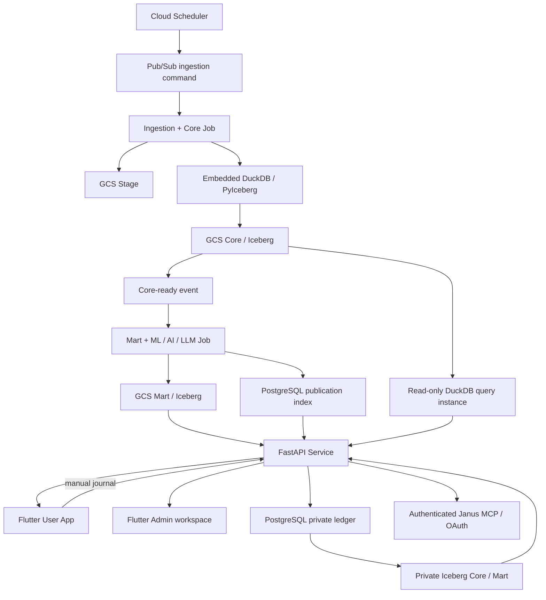

# Janus SPEC — Monorepo 與 GCP 拓撲

## 3. Monorepo 結構

```text
janus-omniforge/
├── apps/
│   ├── user_app/                    # Flutter + Material 3 User／Admin workspaces
│   └── web/                         # migration 期間保留的 static Admin surface
├── jobs/
│   ├── ingestion-core/              # Scrapers、Stage、DQ、Core
│   └── intelligence-mart/           # Features、ML、Agents、LLM、Mart
├── services/
│   ├── api/                         # FastAPI public/private/admin API
├── packages/
│   ├── contracts/                   # Schema、events、API types
│   ├── governance/                  # Parameters、publication policy
│   ├── provenance/                  # Provenance model／validation
│   ├── observability/               # Logging、metrics、errors
│   └── duckdb_query/                # bounded DuckDB／Iceberg read-write primitives
├── infra/                            # GitHub Actions／gcloud／Cloud Build／IAM
├── tests/
│   ├── contract/
│   └── e2e/
└── docs/
```

主要執行／部署單元：

1. `ingestion-core`：Cloud Run Job。
2. `intelligence-mart`：Cloud Run Job。
3. `api`：FastAPI Cloud Run Service，提供 public、private-journal 與 Admin API；Core query 使用獨立、read-only 的內嵌 DuckDB instance。
4. Admin workspace：目標由 `apps/user_app` Flutter 提供，只調用 Admin API；現有
   `apps/web` static Admin 在 parity／auth／browser acceptance 完成前保留，不得先刪除。
5. Janus MCP：由 `api` 提供 authenticated `/mcp` 與 OAuth boundary；只公開 allowlisted、bounded read tools，不承載通用 Agent、provider 或 Chat runtime。
6. `user-app`：Janus Flutter Android／iOS／Web 的投資 User/Admin client；不含 generic Chat client，不持有 provider、MCP server credential、catalog、control DB 或 GCS credential，也不主動呼叫 omniAgent。
## 4. GCP 拓撲



建議區域：`us-central1`。目前使用單一 `janus-dev` project，並將它視為個人使用階段的真實平行上線環境：可承載真實 OAuth、真實個人資料、真實 ingestion／Mart、真實 API／Flutter，以及 Janus authenticated MCP。Janus 不擁有通用 Agent Gateway／provider runtime。`dev` 名稱不代表資料可任意丟棄，也不代表必須用 mock 或假資料。

目前不預先建立 staging、separate production project 或 three-project split。六個月觀察／Pilot evidence 可用來決定未來若進入對外、多使用者、HA／SLA 階段是否需要獨立 Production topology；該 review 不阻擋現階段個人在 `janus-dev` 上真實使用已驗收能力。若未來沒有多人化／正式對外需求，也不因名稱為 `dev` 而強制建立另一套相同資源。

既有 resource name、URL、scripts、Secret reference 與 `*-dev` 命名維持不變，避免只為環境名稱重構。任何 destructive migration、secret handling、owner/auth isolation、重要資料 backup／restore 或可重建能力仍按正式安全邊界處理，因為此環境包含真實個人資料。

## 4.1 Research Context topology guard

ResearchContext、Market Regime、Private Research State 與 ChatGPT MCP 預設重用現有
GCS／Iceberg、PostgreSQL、DuckDB／PyIceberg、Cloud Run 與 `janus-api`。本需求不
導入 BigQuery、Neo4j／Graph DB、Vector DB、Google Drive integration、ChatGPT-specific
Cloud Run service、新 scheduler 或重複 data lifecycle。只有既有 topology 不足的實證、
cost／security／operations／exit review 與使用者明確批准後才可例外。

Research-only／canonical、PIT、provenance、source authorization 等資料治理分類與環境名稱無關；即使資料位於平行上線 dev，也不得把研究暫存結果自動視為 canonical source of truth。
