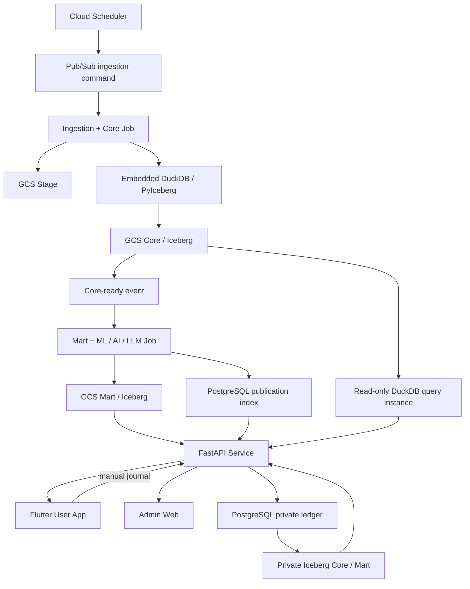

# Janus SPEC — Monorepo 與 GCP 拓撲

## 3. Monorepo 結構

```text
janus-omniforge/
├── apps/
│   ├── user_app/                    # Flutter + Material 3 User App（待建）
│   └── web/                         # 現有 Admin Web，遷移後不承載 public UI
├── jobs/
│   ├── ingestion-core/              # Scrapers、Stage、DQ、Core
│   └── intelligence-mart/           # Features、ML、Agents、LLM、Mart
├── services/
│   └── api/                         # FastAPI public/private/admin API（待建）
├── packages/
│   ├── contracts/                   # Schema、events、API types
│   ├── governance/                  # Parameters、publication policy
│   ├── provenance/                  # Provenance model／validation
│   ├── observability/               # Logging、metrics、errors
│   └── duckdb_query/                # bounded DuckDB／Iceberg read-write primitives
├── infra/                            # GitHub Actions／gcloud／Cloud Build／IAM
├── tests/
│   ├── contract/
│   └── e2e/
└── docs/
```

主要執行／部署單元：

1. `ingestion-core`：Cloud Run Job。
2. `intelligence-mart`：Cloud Run Job。
3. `api`：FastAPI Cloud Run Service，提供 public、private-journal 與 Admin API；Core query 使用獨立、read-only 的內嵌 DuckDB instance。
4. `admin-web`：受限制的 Admin Web 入口，只調用 Admin API。
5. `user-app`：Flutter Android／iOS／Web client，只調用 Public／Private Journal API，不持有 catalog、control DB 或 GCS credential。

## 4. GCP 拓撲



建議區域：`us-central1`。開發初期可使用單一 `janus-dev` project，但 dev／staging／prod 至少要以 bucket、catalog/schema、service account、Cloud Run 名稱與 secret 完整隔離；正式上線前改成三個 project。
