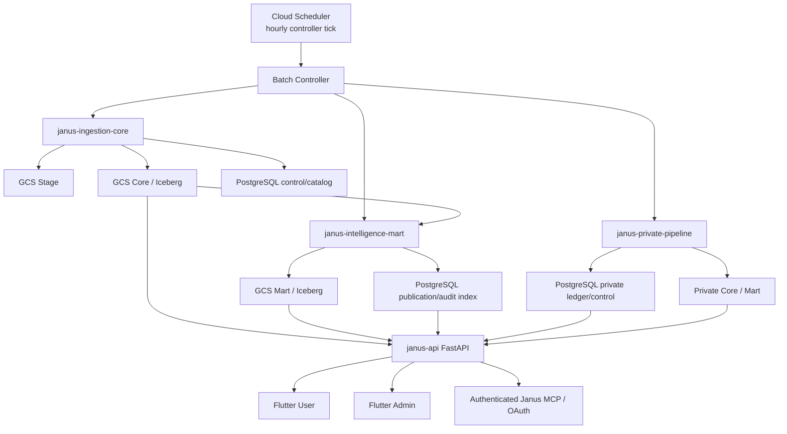

# Janus SPEC — Monorepo 與 GCP 拓撲

更新：2026-10-03

本文件描述目前 active architecture；實際 resource、trigger、job name 與 deployment 狀態仍以 GitHub `main` + live runtime evidence 為準。

## 3. Monorepo 結構

```text
janus-omniforge/
├── apps/
│   ├── user_app/                    # Flutter + Material 3 User／Admin workspaces
│   └── web/                         # retired static Admin source；非 active runtime
├── jobs/
│   ├── ingestion-core/              # Ingestion、Stage/Core、DQ、data supplement、batch controller、Core maintenance
│   └── intelligence-mart/           # Mart、specialist/evaluation、Mart maintenance
├── services/
│   └── api/                         # FastAPI public/private/admin API + authenticated MCP/OAuth
├── packages/
│   ├── contracts/                   # Schema、events、API types
│   ├── governance/                  # Parameters、publication policy
│   ├── provenance/                  # Provenance model／validation
│   ├── observability/               # Logging、metrics、errors
│   └── duckdb_query/                # bounded DuckDB／Iceberg primitives
├── infra/                            # GitHub Actions／gcloud／Cloud Build／IAM
├── tests/                            # contract／integration／e2e 等
└── doc/                              # active contract、runbook、evidence、archive
```

`apps/web` 的 source 存在不代表它仍是可部署的 Admin frontend。2026-10-02 起唯一 active Admin frontend 是 `apps/user_app` Flutter／PWA；legacy static Admin 只具歷史／rollback-source 追溯價值，不是 parity gate。

## 3.1 主要 runtime responsibility

1. **`janus-ingestion-core` Cloud Run Job**
   - ingestion／Stage／Core commit；
   - data supplement／quality；
   - Iceberg／retention maintenance；
   - batch controller code 位於 ingestion-core source。
2. **`janus-intelligence-mart` Cloud Run Job**
   - Mart feature／screening／specialist／evaluation runtime；
   - Mart retention／maintenance；
   - LLM 不屬五 specialist 日常 path；On-demand CEO provider work依 active WBS 實作／驗收。
3. **Private Pipeline**
   - 由既有 `janus-private-pipeline` workload 處理 owner-private derived state／Private Mart 更新；實際 image/source mapping 與有效 trigger 以 GitHub／runtime readback 為準。
4. **`janus-api` FastAPI Cloud Run Service**
   - public／private／Admin HTTP API；
   - authenticated `/mcp` + OAuth boundary；
   - bounded read-only Core／Mart／Private readers；
   - 不承載 generic Chat／Agent runtime。
5. **`apps/user_app` Flutter／PWA**
   - User workspace + Admin `資料營運中心`；
   - 只透過 API 操作，不持有 DB／catalog／GCS credential。

## 4. 現行 dev topology


```mermaid
flowchart TD
    S["Cloud Scheduler\nhourly controller tick"] --> C["Batch Controller"]
    C --> I["janus-ingestion-core"]
    C --> M["janus-intelligence-mart"]
    C --> P["janus-private-pipeline"]

    I --> ST["GCS Stage"]
    I --> CO["GCS Core / Iceberg"]
    I --> PG["PostgreSQL control/catalog"]

    CO --> M
    M --> MA["GCS Mart / Iceberg"]
    M --> PUB["PostgreSQL publication/audit index"]

    P --> PL["PostgreSQL private ledger/control"]
    P --> PM["Private Core / Mart"]

    CO --> API["janus-api FastAPI"]
    MA --> API
    PUB --> API
    PL --> API
    PM --> API

    API --> U["Flutter User"]
    API --> A["Flutter Admin"]
    API --> MCP["Authenticated Janus MCP / OAuth"]
```

這張圖是 responsibility topology，不代替 runtime evidence。某個 batch 是否真的由 controller、direct Scheduler 或其他已核准 trigger 啟動，必須以當下 GitHub main + live Scheduler／Cloud Run execution evidence 判定；Admin 也必須顯示 effective trigger，不由 UI hard-code。

## 4.1 Batch controller

目前 `batch_controller.py` 的固定 logical batches：

- `ingestion`
- `data-supplement`
- `mart`
- `data-quality`
- `private`
- `core-cleanup`
- `mart-cleanup`

Controller 使用 bounded Cloud Run job allowlist、dependency／exclusive guards、occurrence identity 與 persisted event／state；dispatch accepted 不等於 child workload succeeded。

未來 screening、dirty specialist updates、monthly retrain／reconciliation、On-demand CEO execution 只有在對應 implementation／runtime 存在後才加入 control surface；文件不提前創造不存在的 job。

## 4.2 Storage／compute boundary

- **GCS + Iceberg／Parquet**：Stage／Core／Mart／Private derived persistent data。
- **PostgreSQL**：Iceberg catalog、control、execution、publication、audit、service index、private append-only ledger／checkpoint；不保存市場 raw payload 或完整 Mart payload。
- **DuckDB／PyIceberg**：bounded process-local compute／query；不是另一個 persistent database。
- **Flutter**：不直讀 Stage／GCS／PostgreSQL，不自行計算 canonical research／PnL。

Core writer 仍須序列化／受控，避免並行 Iceberg commit conflict；API query runtime read-only。backfill／maintenance 必須有 row／byte／memory／timeout bounds。

## 4.3 Dev environment

目前使用既有 `janus-dev` topology 作個人真實 parallel-live environment，可承載真實 OAuth、個人資料、ingestion／Mart／Private pipeline、API、Flutter 與 MCP。`dev` 名稱不代表資料可任意丟棄或只能使用 mock。

- 不為環境命名美觀另建 staging／production clone。
- 既有 resource name／URL／scripts／Secret references 盡量維持，除非有實際需求。
- destructive migration、secret handling、owner isolation、backup／rebuild、retention 仍按正式資料安全邊界執行。
- Production 多使用者／HA／SLA topology 需日後實際需求與人工核准，不是目前 dev acceptance prerequisite。

## 4.4 Research Context／supply-chain topology guard

ResearchContext、Market Regime、Private Research State、Supply-chain research 與 ChatGPT MCP 優先重用現有 GCS／Iceberg、PostgreSQL、DuckDB／PyIceberg、Cloud Run 與 `janus-api`。

第一版／規劃期不因這些需求自動導入：

- BigQuery；
- Neo4j／Graph DB；
- Vector DB；
- Google Drive runtime integration；
- ChatGPT-specific Cloud Run service；
- 第二套 scheduler／orchestrator；
- 第二套 canonical metadata store。

只有既有 topology 不足的實證、cost／security／operations／exit review 與使用者明確批准後才可例外。

## 4.5 治理邊界

- research-only／canonical、PIT／future leakage、provenance、source authorization 與 public/private isolation 與環境名稱無關。
- LLM／CEO 不擁有 canonical number 或 publication authority。
- source／provider route 是 backend versioned contract，不由 Flutter hard-code。
- retention／cleanup 依 active SPEC；UI 或 controller 不得越權擴張大量不可逆刪除。
- secret、token、password、private key 不進 Git、一般 log、前端或公開輸出。